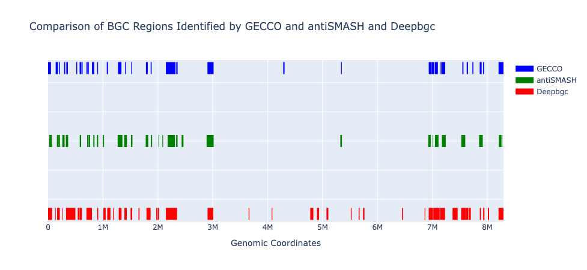
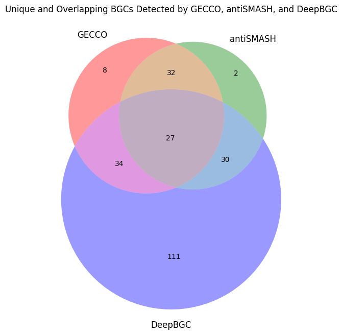
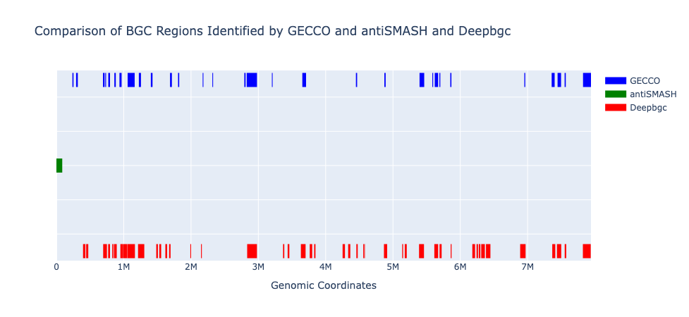
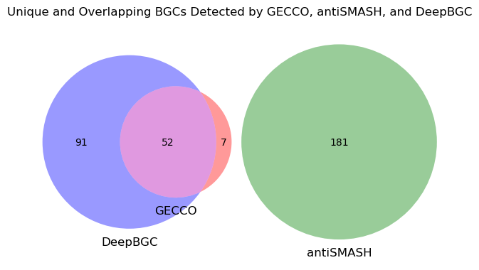
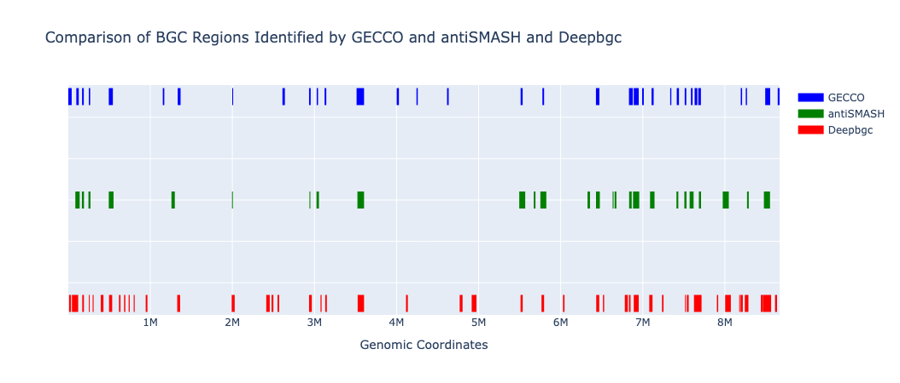
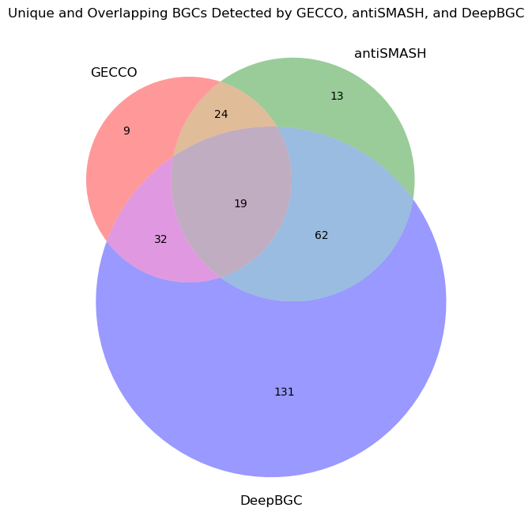

# Biosynthetic Gene Cluster (BGC) Tools Comparison

## Description
This project involves a comparative analysis of different tools used for detecting and classifying biosynthetic gene clusters (BGCs). The notebook explores the performance of various tools using genomic data from Streptomyces avidinii, Streptomyces ameniacus, and S. coelicolor. It includes visualizations such as dynamic genomic coordinate plots and Venn diagrams to illustrate overlaps and differences between the tools.

## Table of Contents
- [Project Overview](#project-overview)
- [Installation](#model-performance-comparison)
- [Tools and Methods](#features)
- [antiSMASH](#dataset)
- [GECCO](#usage)
- [DeepBGC](#project-structure)
- [Results](#contributing)
- [Streptomyces avidinii](#connect-with-me)
- [Streptomyces ameniacus](#project-structure)
- [S. coelicolor](#contributing)
- [Visualization](#connect-with-me)
- [Contributing](#connect-with-me)


## Project Overview
This notebook provides a detailed comparison of BGC detection and classification tools. The primary objectives include:

- Comparing the genomic coordinates reported by each tool.
- Visualizing overlaps and discrepancies using genomic coordinate plots and Venn diagrams.
- Exploring the applicability of emerging tools such as Microsoft's protein sequence models.


## Installation
To replicate the analysis, follow these steps:

1. Clone this repository or download the  `main.ipynb` notebook.
2. Install the required dependencies using pip:
```
pip install pandas numpy matplotlib seaborn
pip install antismash gecco deepbgc
```

3. (Optional) Set up Jupyter Notebook or JupyterLab to execute the notebook:
```
pip install notebook
jupyter notebook main.ipynb
```

## Tools and Methods
**antiSMASH**

Applied to Streptomyces avidinii, Streptomyces ameniacus, and S. coelicolor.

Provides detailed annotations and classifications of BGCs.

**GECCO**

Focuses on gene cluster detection using a rule-based approach.

Analyzed for the same Streptomyces species as antiSMASH.

**DeepBGC**

Utilizes machine learning models to classify BGCs.

Tested on multiple Streptomyces genomes.

## Results
### **Streptomyces avidinii**

Comparison of coordinates reported by tools.

```
Unique regions in GECCO: 8
Unique regions in AntiSMASH: 2
Unique regions in DeepBGC: 111
Intersection between GECCO and AntiSMASH: 32
Intersection between GECCO and DeepBGC: 34
Intersection between AntiSMASH and DeepBGC: 30
Intersection across all three tools: 27
```

Visualization of overlaps using dynamic plots and Venn diagrams.






***

### **Streptomyces ameniacus**

Comparison of coordinates reported by tools.
```
Unique regions in GECCO: 7
Unique regions in AntiSMASH: 181
Unique regions in DeepBGC: 116
Intersection between GECCO and AntiSMASH: 0
Intersection between GECCO and DeepBGC: 26
Intersection between AntiSMASH and DeepBGC: 0
Intersection across all three tools: 0
```

Visualization of overlaps using dynamic plots and Venn diagrams.






***

### **S. coelicolor**

Comparison of coordinates reported by tools.
```
Unique regions in GECCO: 9
Unique regions in AntiSMASH: 5
Unique regions in DeepBGC: 166
Intersection between GECCO and AntiSMASH: 24
Intersection between GECCO and DeepBGC: 32
Intersection between AntiSMASH and DeepBGC: 22
Intersection across all three tools: 19
```

Visualization of overlaps using dynamic plots and Venn diagrams.




